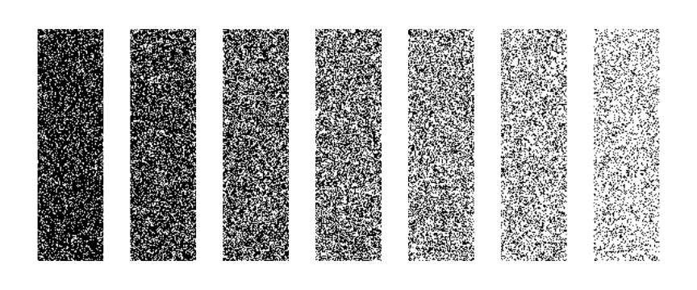
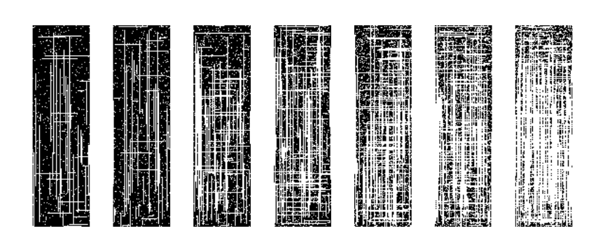
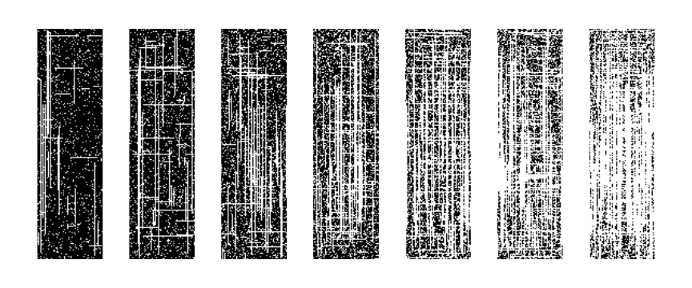
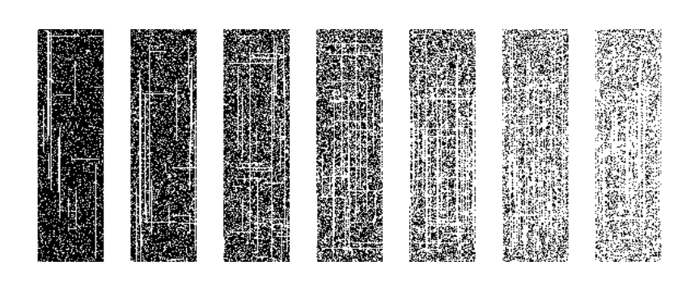
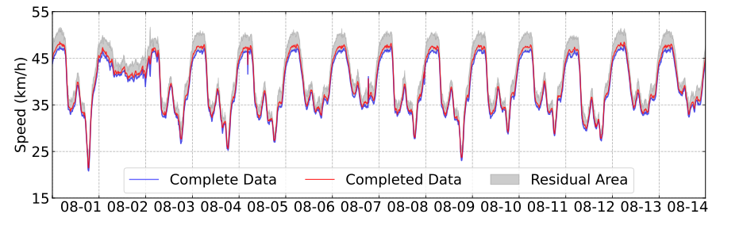
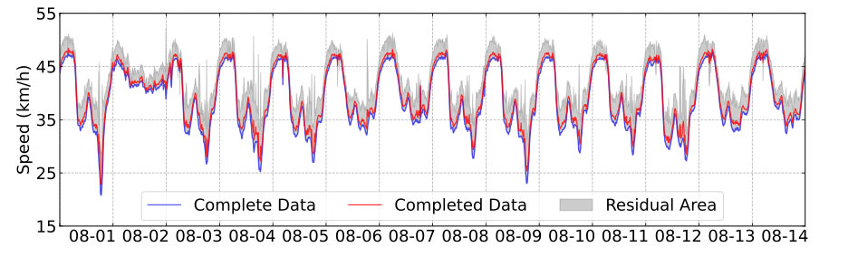
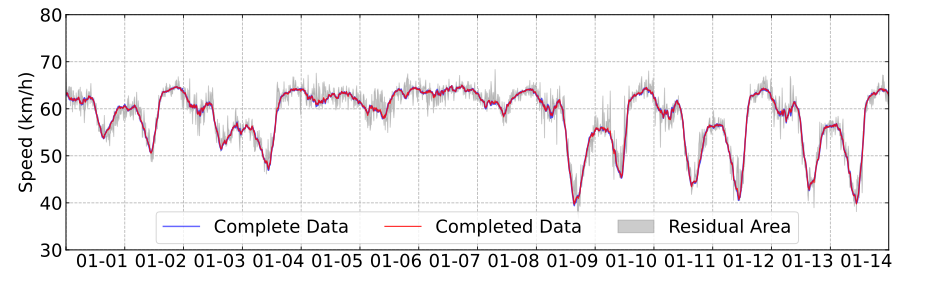
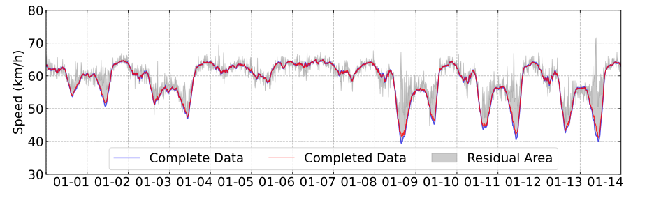

# LRTC-ATSN: Adaptive and Truncated Schatten Norm for Traffic Data Imputation

> **Low-Rank Tensor Completion with Adaptive Truncated Schatten p-Norm (LRTC-ATSN)**  
> A principled approach for spatiotemporal traffic data imputation under complex missing patterns.

[](https://www.python.org/)
[](LICENSE)
[](https://ascelibrary.org/doi/10.1061/9780784486269.009)

---

## 📖 Overview

Accurate traffic data imputation is critical for Intelligent Transportation Systems (ITS). Real-world sensor data frequently contains missing values due to detector failures, low sensor coverage, and communication disruptions. This repository implements **LRTC-ATSN** — a low-rank tensor completion method that leverages an **adaptive and truncated Schatten p-norm** to better characterize the low-rank structure of spatiotemporal traffic tensors.

Key innovations:
- **Adaptive p**: the Schatten norm order *p* is updated automatically during optimization, balancing convexity and rank approximation quality.
- **Truncated singular value weighting**: focuses regularization on the truly informative singular values, reducing over-shrinkage.
- **ADMM solver**: efficient alternating direction method of multipliers with theoretical convergence guarantees.
- **Adam-momentum parameter adaptation**: all three hyperparameters (*p*, *θ*, *α*) adapt with momentum, improving convergence stability.

---

## 🗂️ Repository Structure

```
ATSN-Traffic-Imputation/
├── src/
│   ├── atsn/                    # Core package
│   │   ├── __init__.py
│   │   ├── tensor_ops.py        # Tensor fold/unfold, GST proximal op, SVT
│   │   ├── metrics.py           # MAE, RMSE, MAPE, ER evaluation metrics
│   │   ├── missing.py           # Random / fiber / mixed missing generators
│   │   └── lrtc_atsn.py         # Proposed LRTC-ATSN algorithm
│   └── baselines/               # Comparison algorithms
│       ├── __init__.py
│       ├── halrtc.py            # HaLRTC (He et al., 2014)
│       ├── lrtc_tnn.py          # LRTC-TNN
│       ├── lrtc_tspn.py         # LRTC-TSpN
│       ├── bgcp.py              # BGCP (Bayesian Gaussian CP)
│       ├── bpmf.py              # BPMF (Bayesian PMF)
│       ├── trmf.py              # TRMF (Temporal Regularized MF)
│       └── isvd.py              # ISVD (Iterative SVD)
├── experiments/
│   ├── run_experiment.py        # Single-algorithm CLI runner
│   ├── compare_baselines.py     # Reproduce paper comparison tables
│   └── plot_convergence.py      # Convergence curve visualization
├── data/
│   ├── raw/                     # Guangzhou (.mat) and Seattle (.npz) datasets
│   └── processed/               # Preprocessed / masked tensors
├── docs/figures/                # Paper figures (SVG)
├── results/figures/             # Output plots
├── tests/                       # pytest unit tests
├── pyproject.toml
├── requirements.txt
└── README.md
```

---

## 🚦 Missing Pattern Illustrations

The following four scenarios represent the missing patterns studied in this work (Random Missing, Fiber Missing, and two Mixed Missing configurations):

<table>
  <tr>
    <td align="center"><br/><b>(a) Random Missing (RM)</b></td>
    <td align="center"><br/><b>(b) Fiber Missing (FM)</b></td>
  </tr>
  <tr>
    <td align="center"><br/><b>(c) Mixed Missing — Light (MM-L)</b></td>
    <td align="center"><br/><b>(d) Mixed Missing — Heavy (MM-H)</b></td>
  </tr>
</table>

---

## 📊 Imputation Results Visualization

Representative imputation results on the Guangzhou and Seattle datasets across missing patterns:

<table>
  <tr>
    <td align="center"><br/><b>(a) Guangzhou — Random Missing</b></td>
    <td align="center"><br/><b>(b) Guangzhou — Fiber Missing</b></td>
  </tr>
  <tr>
    <td align="center"><br/><b>(c) Seattle — Random Missing</b></td>
    <td align="center"><br/><b>(d) Seattle — Fiber Missing</b></td>
  </tr>
</table>

---

## 📦 Datasets

| Dataset | Size | Description |
|---------|------|-------------|
| **Guangzhou** | 214 roads × 61 days × 144 time slots | Urban road speed, 10-min intervals |
| **Seattle** | 323 sensors × 28 days × 288 time slots | Freeway loop detector speed, 5-min intervals |

---

## ⚙️ Installation

```bash
git clone https://github.com/QianyHP/Adaptive_and_Truncated_Schatten_Norm_Low-Rank_Tensor_Completion.git
cd Adaptive_and_Truncated_Schatten_Norm_Low-Rank_Tensor_Completion
pip install -r requirements.txt
```

**Requirements:** Python ≥ 3.8, NumPy, SciPy, scikit-learn, tqdm, matplotlib

---

## 🔬 Baseline Methods

| Method | Type | Reference |
|--------|------|-----------|
| HaLRTC | Tucker-norm relaxation | Liu et al., 2013 |
| LRTC-TNN | Tensor nuclear norm | Chen et al., 2020 |
| LRTC-TSpN | Truncated Schatten p-norm | He et al., 2022 |
| BGCP | Bayesian CP decomposition | Zhao et al., 2015 |
| BPMF | Bayesian probabilistic MF | Salakhutdinov & Mnih, 2008 |
| TRMF | Temporal regularized MF | Yu et al., 2016 |
| ISVD | Iterative SVD | Cai et al., 2010 |

---

## 💬 Citation

If you find this work useful, please cite:

```bibtex
@inproceedings{deng2025atsn,
  title     = {Adaptive Truncated Schatten Norm for Traffic Data Imputation
               with Complex Missing Patterns},
  author    = {Deng, Haopeng and Zheng, Fucheng and Ma, Kaixiang and Xia, Xinhai},
  booktitle = {Proceedings of the 25th COTA International Conference of
               Transportation Professionals (CICTP 2025)},
  pages     = {88--99},
  year      = {2025},
  publisher = {American Society of Civil Engineers},
  doi       = {10.1061/9780784486269.009},
  url       = {https://ascelibrary.org/doi/10.1061/9780784486269.009}
}
```
